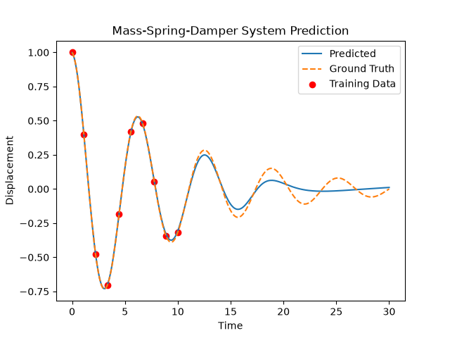

# Physics Informed Neural Networks (PINNs) Example

This example demonstrates how to use the Phlower framework to implement a simple Physics Informed Neural Network (PINN) for solving a differential equation. 


## Problem Setup

We will use mass-spring-damper system as an example to illustrate the implementation of a PINN. The governing equation for this system is given by:

```math
m \frac{d^2x}{dt^2} + c \frac{dx}{dt} + kx = 0
```

where:
- $`m`$ is the mass,
- $`c`$ is the damping coefficient,
- $`k`$ is the spring constant,
- $`x(t)`$ is the displacement as a function of time \( t \). 


As a initial condition, we will assume the following:

- Initial displacement: $`x(0) = 1`$
- Initial velocity: $`frac{dx}{dt}(0) = 0`$


## How to Run the Example

```
uv run python3 main.py [-h] [--n-epoch N_EPOCH]

Run PINN example.

options:
  -h, --help         show this help message and exit
  --n-epoch N_EPOCH  Number of training epochs.
```


## Results

The following figure shows the predicted results of the PINN model after training. This results are gained when the number of training epochs is set to 10000.



